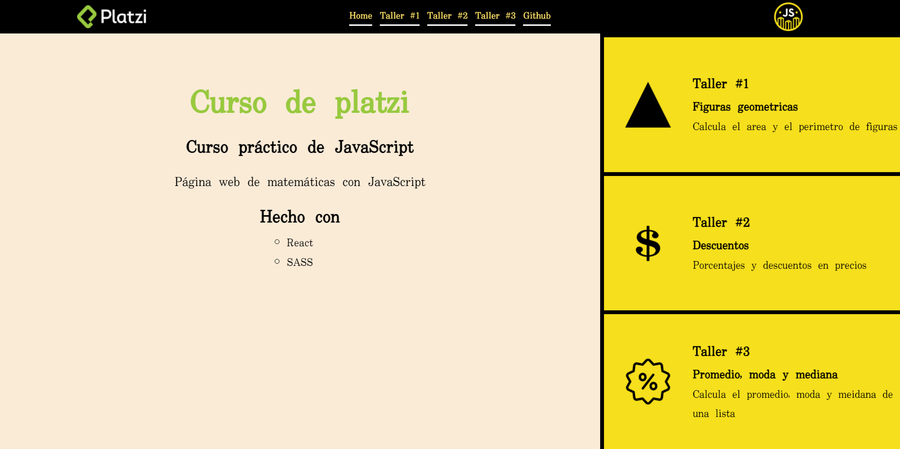
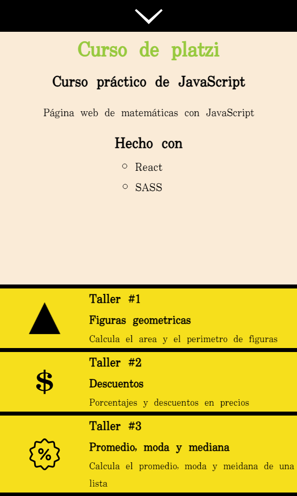

# Curso practico de JavaScript de Platzi

Curso para reforzar habilidades basicas de JavaScript

[Pagina en Github pages](https://emmanuelfrias.com/curso-platzi-js/#/)

Vista de pc:

Vista de telefono:

### Taller #1 - Figuras geometricas

Calcula el area y perimetro de figuras

[Link](https://emmanuelfrias.com/curso-platzi-js/#/Figuras)

### Taller #2 - Decuentos

Porcentajes y descuentos en precios

[Link](https://emmanuelfrias.com/curso-platzi-js/#/Descuentos)

### Taller #3 - Promedio, moda y mediana

Calcula el primedio, moda y mediana de una lista

[Link](https://emmanuelfrias.com/curso-platzi-js/#/Estadistica)

## Tecnologias usadas:

### Hecho con

- React
- SASS
- JavaScript

